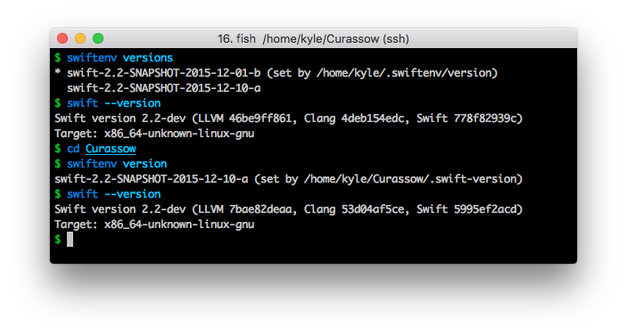

# Swift Version Manager

[](https://travis-ci.org/kylef/swiftenv)

swiftenv allows you to easily install, and switch between multiple versions of Swift.

This project was heavily inspired by [pyenv](https://github.com/yyuu/pyenv).



swiftenv allows you to:

- Change the **global Swift version**, per user.
- Set a **per-project Swift version**.
- Allows you to **override the Swift version** with an environmental variable.

## Installation

**NOTE**: If you're on OS X, consider [installing with Homebrew](#via-homebrew).

### Via a Git clone

1. Check out swiftenv, we recommend `~/.swiftenv` (but it can be installed elsewhere as long as you set `SWIFTENV_ROOT`).

    ```shell
    $ git clone https://github.com/kylef/swiftenv.git ~/.swiftenv
    ```

2. Configure environment.

    For Bash:

    ```shell
    $ echo 'export SWIFTENV_ROOT="$HOME/.swiftenv"' >> ~/.bash_profile
    $ echo 'export PATH="$SWIFTENV_ROOT/bin:$PATH"' >> ~/.bash_profile
    $ echo 'eval "$(swiftenv init -)"' >> ~/.bash_profile
    ```

    **NOTE**: *On some platforms, you may need to modify `~/.bashrc` instead of `~/.bash_profile`.*

    For ZSH:

    ```shell
    $ echo 'export SWIFTENV_ROOT="$HOME/.swiftenv"' >> ~/.zshenv
    $ echo 'export PATH="$SWIFTENV_ROOT/bin:$PATH"' >> ~/.zshenv
    $ echo 'eval "$(swiftenv init -)"' >> ~/.zshenv
    ```

    For Fish:

    ```shell
    $ echo 'setenv SWIFTENV_ROOT "$HOME/.swiftenv"' >> ~/.config/fish/config.fish
    $ echo 'setenv PATH "$SWIFTENV_ROOT/bin" $PATH' >> ~/.config/fish/config.fish
    $ echo 'status --is-interactive; and . (swiftenv init -|psub)' >> ~/.config/fish/config.fish
    ```
    
    For other shells, please [open an issue](https://github.com/kylef/swiftenv/issues/new) and we will visit adding support.

3. Restart your shell so the changes take effect.

### Via Homebrew

You can install swiftenv using the [Homebrew](http://brew.sh/) package manager
on OS X.

```shell
$ brew install kylef/formulae/swiftenv
```

## Usage

### Commands

##### `version`

Displays the current active Swift version and why it was chosen.

```shell
$ swiftenv version
2.2-SNAPSHOT-2015-12-10-a (set by /home/kyle/.swiftenv/version)
```

##### `versions`

Lists all installed Swift versions, showing an asterisk next to the currently
active version.

```shell
$ swiftenv versions
  2.2-SNAPSHOT-2015-12-01-b
* 2.2-SNAPSHOT-2015-12-10-a (set by /home/kyle/.swiftenv/version)
```

##### `global`

Sets the global version of Swift to be used by writing to the
`~/.swiftenv/version` file. This version can be overridden by
application-specific `.swift-version` file, or by setting the `SWIFT_VERSION`
environment variable.

```shell
$ swiftenv global 2.2-SNAPSHOT-2015-12-10-a
$ swiftenv global
2.2-SNAPSHOT-2015-12-10-a
```

##### `local`

Sets the local application-specific Swift version by writing the version to a
`.swift-version` file in the current directory. This version overrides the
global version and can also be overridden by th `SWIFT_VERSION` environment
variable.

```shell
$ swiftenv local 2.2-SNAPSHOT-2015-12-10-a
$ swiftenv local
2.2-SNAPSHOT-2015-12-10-a
```

##### `install`

Installs a version of Swift. This supports any binary release provides by
Apple. For example, a 2.2 snapshots such as `2.2-SNAPSHOT-2016-01-11-a`.

You may also specify `2.2-dev` to build Swift from source, this will require
all of the dependencies mention on
[Swift system
requirements](https://github.com/apple/swift#system-requirements). It is
important to note that the Swift Package Manager will not be installed with
`2.2-dev` as Swift Package Manager is still in early development and it won't
be included in 2.2, however it is available in the binary snapshots.

```shell
$ swiftenv install 2.2-SNAPSHOT-2016-01-11-a
Downloading 2.2-SNAPSHOT-2016-01-11-a from https://swift.org/builds/ubuntu1510/swift-2.2-SNAPSHOT-2016-01-11-a/swift-2.2-SNAPSHOT-2016-01-11-a-ubuntu15.10.tar.gz
```

You may also manually install Swift and make it accessible to swiftenv. Custom
Swift installations can either be placed in a directory using the correct
version number at `~/.swiftenv/versions/VERSION`, or can be symbolic
linked into the version directory.

It is expected that all dependencies are already installed for running Swift,
please consult the [Swift website](https://swift.org/download/) for more
information.

**NOTE**: *After manually installing a version of Swift, it's recommended that
you run `swiftenv rehash` to update the shims.*

##### `uninstall`

Uninstalls a specific Swift version.

```shell
$ swiftenv uninstall 2.2-SNAPSHOT-2015-12-10-a
```

##### `rehash`

Installs shims for the Swift binaries. This command should be ran after you
manually install new versions of Swift.

```shell
$ swiftenv rehash
```

##### `which`

Displays the full path to the executable that would be invoked for the selected
version for the given command.

```shell
$ swiftenv which swift
/home/kyle/.swiftenv/versions/swift-2.2-SNAPSHOT-2015-12-10-a/usr/bin/swift

$ swiftenv which lldb
/home/kyle/.swiftenv/versions/swift-2.2-SNAPSHOT-2015-12-10-a/usr/bin/lldb
```
